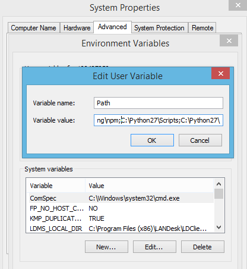
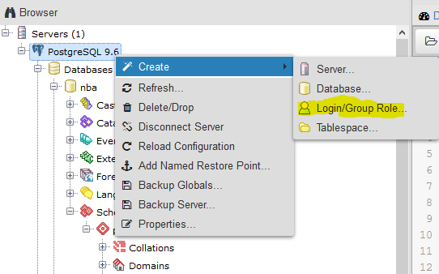
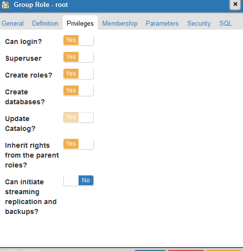
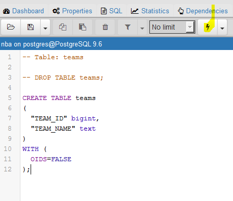
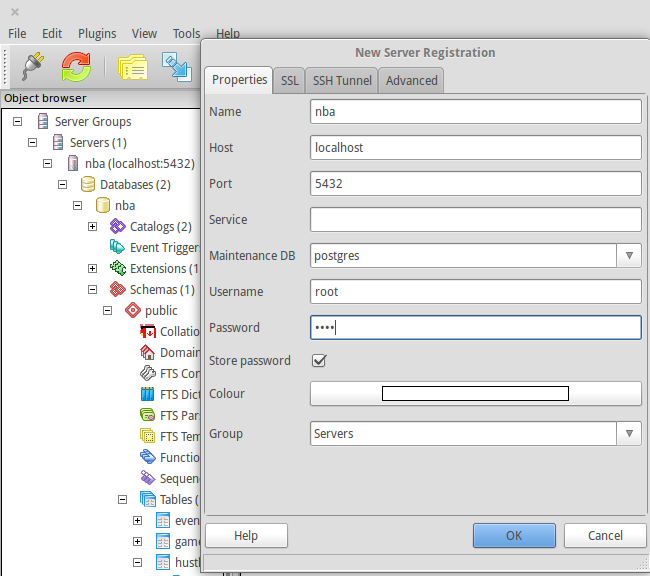
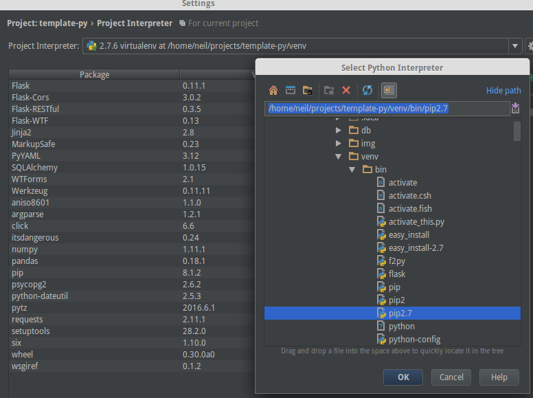
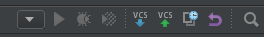
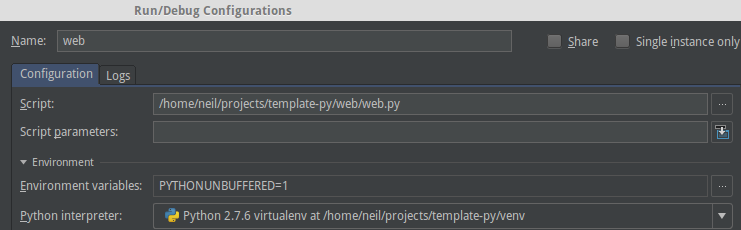
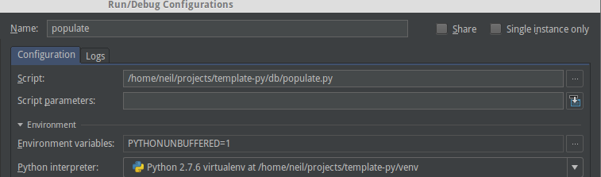

# data-management-lab-7
Repository to hold setup instructions for lab 7.

# Setup
- [Windows](#windows-setup)
- [Linux](#linux-setup)
- [Pycharm Setup](#pycharm-ide-setup)
- [Running Project](#run-project)
- [Additional Styling](#styling)
- [Tasks to Complete For Lab](#complete)

# Windows Setup
- Install git [if not already installed](https://git-scm.com/download/win)
- Clone project *run in cmd as admin*
```
git clone https://github.com/sealneaward/template-py
```
- Install [Python 2.7](https://www.python.org/downloads/release/python-2712/)
- Add Python and Python scripts to path variable, **no spaces**



- Install dependencies *run in cmd as admin in project folder*
- More documentation on [venv](http://docs.python-guide.org/en/latest/dev/virtualenvs/)
```
pip install virtualenv virtualenvwrapper
virtualenv venv
venv\Scripts\activate
pip install -r requirements.txt
python setup.py build
python setup.py install
deactivate
```
- Install [PostgreSQL](https://www.postgresql.org/download/windows/)
- Install [pgAdmin3](https://www.pgadmin.org/download/windows.php)

### PostgreSQL Database Setup
- Follow the instruction [here](https://confluence.atlassian.com/display/CONF30/Database+Setup+for+PostgreSQL+on+Windows)
- Make sure to create a new login user for **user**: *root* with **password**: *root*



- **Pay attention to the role settings when creating the role**



- When creating a database, make sure to create a database with the following info

| Database       | Owner           | Password  |
| ------------- | ------------- | ----- |
| nba    | root | root |

- open up pgAdmin3
- add new add new database
- enter in the configuration details


- Use the .sql scripts in the db/schema folder to create the tables. Run as queries.



# Linux Setup
- Install git if not already installed
```
sudo apt-get install git
```
- setup virtual environment in project folder [more documentation](http://docs.python-guide.org/en/latest/dev/virtualenvs/)
```
sudo apt install python-pip python-dev build-essential libpq-dev
sudo apt-get install postgresql pgadmin3
sudo pip install virtualenv virtualenvwrapper
virtualenv venv
source venv/bin/activate
pip install -r requirements.txt
python setup.py build
python setup.py install
deactivate
```

### PostgreSQL Database Setup
- run these commands in terminal
```
sudo su postgres
createuser root
createdb nba -O root
psql
\password root
password: root
enter it again: root
\q
exit
```
- open up pgAdmin3
- add new conection (click on electric plug at top left corner)
- enter in the configuration details


| Server       | Owner           | Password  |
| ------------- | ------------- | ----- |
| nba    | root | root |


# PyCharm IDE Setup
- download and install [PyCharm](https://www.jetbrains.com/pycharm/)
- you can get a free license from JetBrains if you are a [student](https://www.jetbrains.com/student/)
- to add your venv as an interpreter follow these [instructions](https://www.jetbrains.com/help/pycharm/2016.1/adding-existing-virtual-environment.html)



### PyCharm Debugging
- click on the dropdown arrow  and select edit configurations
- add a python configuration with the following settings

**For Web Server**


**For Databse Population**


# Run Project
- use configurations created in PyCharm for `web.py` and `populate.py`
- to run, click the green arrow button besides the dropdown used for configuration


- to debug, click on the green sun icon


**Note:** You can run the web and populate scripts on the command line if you ran the package installation on db.

# Styling
- I used Materialize.css for this project

# Complete
For this lab, I really want to gauge your understanding of webservers and how they operate. All you have to do is add some simple text fields to the stats.html template output. I will ask you other questions if you used a different template for this lab, or completed a different task.
